# "Smoke on the Water" - Leg 3

| What            | Description
| --------------- | ----------------
| Date            | January 12 2021
| Time            | 1930Z
| Server          | North Europe
| Multiplayer     | All
| Voice Chat      | Event channel on the official FS2020 Discord server https://discord.gg/msfs
| Aircraft        | Cub Crafter X Cub (cruising speed will be between 90-100 knots)
| Weather         | Live Weather (or Few Clouds)
| Simulation Time | 1400 local
| Flight Plan     | [Tell Tours - Bern to Geneva.pln](./Tell%20Tours%20-%20Bern%20to%20Geneva.pln)
| Calendar        | [Tell Tours - Bern to Geneva.ics](./Tell%20Tours%20-%20Bern%20to%20Geneva.ics)
| FS Forum        | [[Tell Tours] Switzerland - "Smoke on the Water"](https://forums.flightsimulator.com/t/tell-tours-switzerland-smoke-on-the-water-leg-3/345068/)

[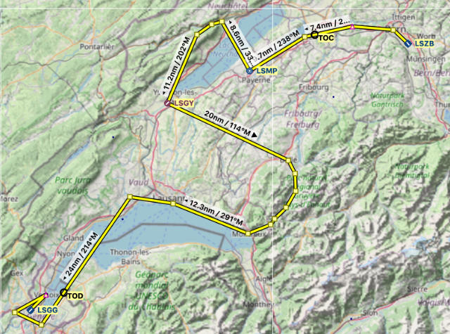](./Tell%20Tours%20-%20Bern%20to%20Geneva.pln "Flight plan - leg 3") 

## Optional Sceneries

| Description                 | Download
| --------------------------- | ----------------------------------------------------------
| Bern                        | https://flightsim.to/file/2181/bern-switzerland
| Lausanne                    | https://flightsim.to/file/2516/lausanne-switzerland
| Château de Vufflens         | https://flightsim.to/file/2842/chateau-de-vufflens-vufflens-castle-suisse-switzerland
| Geneva                      | https://flightsim.to/file/2848/geneva-city-switzerland
| Geneva LSGG Aerial Textures | https://flightsim.to/file/4516/geneva-lsgg-aerial-textures

# Bern-Belp (LSZB) to Geneva (LSGG)

## Bern

* **De facto Capital** of Switzerland
* Switzerland does **not have an official (de jure) capital city** in the technical sense
* Population of **144,000** (as of 2020)
* Including agglomeration population of **406,900** (as of 2014)
* The **historic old town** (Altstadt) in the centre became a **UNESCO World Heritage Site** in 1983
* In **1353**, Bern joined the **Swiss Confederacy**, becoming one of the **eight cantons** of the formative period of 1353 to 1481
* Bern was made the **Federal City** (seat of the Federal Assembly) within the **new Swiss federal state in 1848**
* The structure of **Bern's city** centre is largely **medieval**
* Perhaps its most famous sight is the **Zytglogge** (Bernese German for **"Time Bell"**), an elaborate medieval **clock tower with moving puppets** 
* Thanks to **6 kilometres (4 miles) of arcades**, the old town boasts one of the ***ongest covered shopping promenades in Europe**
* Since the **16th century**, the city has had a **bear pit**, the **Bärengraben**
* The **four bears** are now kept in an **open-air enclosure nearby**, and **two other young bears**, a **present by the Russian president**, are kept in **Dählhölzli zoo**
* The **Federal Palace (Bundeshaus)**, built from **1857 to 1902**, which houses the **national parliament**, **government** and part of the **federal administration**
* **Albert Einstein** lived in a flat at the Kramgasse 49, the site of the Einsteinhaus, from **1903 to 1905**
* [Wiki: Bern](https://en.wikipedia.org/wiki/Bern)
* [admin.ch Facts & Figures](https://www.eda.admin.ch/aboutswitzerland/en/home/politik/uebersicht/politisches-system-der-schweiz---fakten-und-zahlen.html)

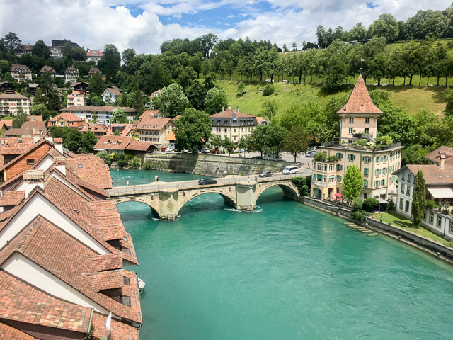
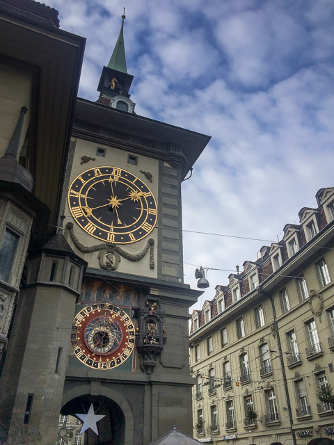

## Swiss Political System – Facts and Figures

### Direct democracy
* **Popular initiative**: citizens the right to propose an **amendment** or **addition** to the **Constitution**
  -  **100,000 voters** who support the proposal must be collected within **18 months**
* The **optional referendum** allows the people to demand that any bill approved by the Federal Assembly is put to a nationwide vote
  -  **50,000 valid signatures** must be collected within **100 days of publication** of the new legislation
* All **constitutional amendments approved by parliament are subject to a mandatory referendum**, i.e. they must be put to a nationwide popular vote
  - The electorate are also required to approve **Swiss membership of specific international organisations**
* The Swiss electorate are called on approximately **four times a year** to exercise this right

### The Federal Assembly (parliament)
* The **Swiss Parliament** (**"Bundesversammlung"** - **Federal Assembly)** has a total of **246 members**, who are directly elected by the people
* Switzerland has a **bicameral parliament**: the **National Council (200 members)** and the **Council of States (46 members)**
* The **Federal Assembly** is the **legislative power** of Switzerland
* Its two chambers – the **National Council** (**"Nationalrat"**) and the **Council of States** (**"Ständerat"**) –have the **same powers but meet separately**
* The number of representatives sent by each canton depends on the size of its population
* **15 political parties** are represented in the **Swiss Parliament**
* Those **parties with the largest share** of the popular vote are **represented on the Federal Council**
* According to the **consociational model** of democracy adopted in Switzerland, left-wing, right-wing and centrist parties all **share executive power**

### Federalism
* Although its official name is the **Swiss Confederation** ("Eidgenossenschaft" - for historical reasons), Switzerland has, in fact, been a federal state ("Bundesstaat") **since 1848**
* The powers of the Confederation are limited to those areas explicitly entrusted to it by the Federal Constitution
* Responsibility for all other matters, such as **education**, **health** and **policing**, fall to the **cantons**, which enjoy a high degree of policy-making autonomy in these areas

### The Federal Council
* The **Federal Council** (Bundesrat) is the highest executive authority of the Swiss Confederation
* Its members **represent Switzerland’s main political parties**
* The **Swiss federal government** (the **Federal Council**) is made up of **seven members**, who are **elected by parliament**
* Each Federal Councillor is appointed to serve a **one-year term as President of the Confederation by the Federal Assembly** in accordance with the principle of seniority  
* The Federal President chairs the **sessions of the executive** and undertakes special **ceremonial duties**, particularly abroad
* As a **collegial body**, the Federal Council must remain **unanimous when presenting cabinet decisions to the public**, even if it is **contrary to their personal view or to the official line taken by their party**
* At the present time, the Federal Council has two representatives from the **Liberal Party (FDP)**, two representatives from the **Swiss Social Democratic Party (SP)**, two representatives from the **Swiss People’s Party (SVP)**, and one representative from the **Swiss Christian Democratic Party (CVP)**
* Each member of the Federal Council also heads a **federal department**  
* Elected by the **United Federal Assembly** 
  - **As of 2021**: Viola Amherd, Simonetta Sommaruga, Ignazio Cassis (vice-president), President Guy Parmelin, Ueli Maurer, Alain Berset, Karin Keller-Sutter, Walter Thurnherr
  - Three women (out of seven Federal Councillors)

### Women in Politics

* Women in Switzerland gained the **right to vote** in **federal elections** after a referendum in **February 1971**
* In **1991** following a **decision by the Federal Supreme Court** of Switzerland, **Appenzell Innerrhoden (AI)** became the **last Swiss canton** to grant women the **vote on local issues**
  - AI is the smallest Swiss canton with c. 14,100 inhabitants in 1990

### Comparison with the Oldest Democracy

* The **oldest democracy is the USA**, with its constitution come into effect in **1789**: "We the People..."
* **Switzerland** is the second-oldest democracy, since **1848**
* Third is **New Zealand (1857)**, the first self-governing colony to allow women the rights to vote in parliamentary elections
* No other countries in the world have such strong direct democratic people’s rights as the United States and Switzerland
* But unlike the Swiss, Americans don’t have a say at the national level
* However half of the USA country’s 50 states are familiar with the particularities of the people’s initiative and the referendum (also known as the people’s veto)
* Indeed, **modern direct democracy** – characterised by **votes on initiatives and referendums** – shapes everyday political life in the US as in almost no other country in the world – except Switzerland
* It’s no coincidence that the two federalist states have **strongly influenced one another in the past**
* In a historical sense, Switzerland copied the **concept of federalism from the United States**, while the US took the idea of **direct democracy from Switzerland**
* But in fact, **neither the Americans nor the Swiss were the inventors of these concepts**, which are important elements of our political systems today 
* Today, it is considered a fact that **Benjamin Franklin** – one of the founding fathers of the US – took his inspiration for the writing of the first **American federalist constitution** from the **Iroquois Native American tribe**
* Credit for the development of **direct democracy** and **people’s rights** concepts goes to the **French Marquis de Condorcet**, a “Renaissance man”
* At the **French Constitutional Convention in 1792**, Condorcet explained that **“active and personally engaged citizens are a prerequisite”**
* As a result, he **proposed the right to a people’s initiative**
* Neither **France nor Condorcet survived the subsequent turmoil** (**French Revolution**), however, and so today the French constitution is devoid of the strongest of all people’s rights
* In neighbouring Switzerland, however, Condorcet’s ideas found fertile ground
* Both the **people’s initiative** and the **referendum** were adopted in **almost all Swiss cantons** before finding their way **into the Federal Constitution in 1891**
* This peaceful revolutionary development caught the attention of American journalists at the end of the 19th century * They set out on a field trip to learn about democracy in Switzerland
* The reporter **J. W. Sullivan** so thrillingly described the “Swiss model” in his **newspaper articles and books** that the topic of **direct democracy soon left its mark on the debate over political reforms in the US** 

* [admin.ch: Overview Swiss Democracy](https://www.eda.admin.ch/aboutswitzerland/en/home/politik/uebersicht.html)
* [swissinfo.ch:  Swiss and US democracy: twins separated at birth?](https://www.swissinfo.ch/eng/directdemocracy/swiss-us-democracy_standing-at-the-forefront-of-swiss-federalism-were-the-iroquois/43645216)
* [Wiki: Marie Jean Antoine Nicolas Caritat, Marquis de Condorcet](https://de.wikipedia.org/wiki/Marie_Jean_Antoine_Nicolas_Caritat,_Marquis_de_Condorcet)
* [Direct Democracy: Ties between Switzerland and the U.S.](https://blogs.loc.gov/law/2014/10/direct-democracy-ties-between-switzerland-and-the-u-s/)
* [Mapped: The world’s oldest democracies](https://www.weforum.org/agenda/2019/08/countries-are-the-worlds-oldest-democracies)
* [Wiki: Women's suffrage in Switzerland](https://en.wikipedia.org/wiki/Women%27s_suffrage_in_Switzerland)

## Murten

* Morat has a **population** (as of December 2019) of **8,259**
* On **22 June 1476**, Charles the Bold, **Duke of Burgundy**, laid **siege** to the place in an action known as the **Battle of Morat**
* The town hung on for **13 days** but finally was saved by the **Bernese army**
* On **21 June 1476**, Charles expected the Confederation forces to attack
* He arranged his army and prepared for the coming assault
* However, the **Swiss commanders decided to wait** an additional day for the **troops from Zürich**
* After about six hours of waiting Charles ordered his troops to stand down and return to camp
* On **22 June 1476**, around **mid-morning**, Charles ordered his treasurer to **pay the entire army**, expecting the Confederate troops to continue delaying
* The **orderly lines of the Burgundian army dissolved into chaos** as soldiers scattered throughout the camp collecting their **pay, eating their midday meal, and seeking shelter from the rain**
* The **skeleton force that remained at the Grunhag** were s**urprised when the Swiss army**, in battle order, emerged from the woods less than 1,000 m (1,100 yd) from their lines
* The enemy's army was destroyed completely — **some 10,000 Burgundians were killed**
* Since then, Murten celebrates the **victory** every year on **June 22**

* [Wiki: Murten](https://en.wikipedia.org/wiki/Murten)
* [Wiki: Battle of Morat](https://en.wikipedia.org/wiki/Battle_of_Morat)

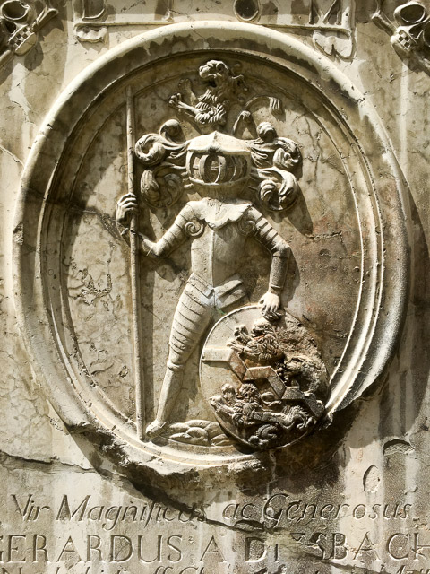
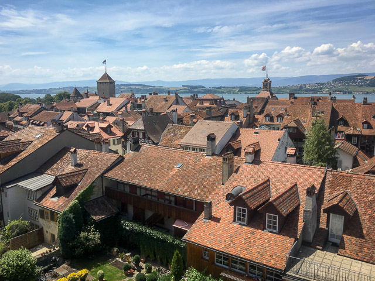

## Payerne (LSMP)

* Elevation: 447 m (1467 ft)
* Runway 23 (right)
* On **8 July 2010**, Payerne Air Base was the location from which the long-range experimental **solar-powered aircraft Solar Impulse 1** achieved the **world's first manned 26-hour solar-powered flight**
* Payerne also became the **home base** for the **successor Solar Impulse 2** (HB-SIB) aircraft, with the aircraft's first flight made from Payerne on 2 June 2014.
* Began the **journey around the world** from Al Bateen Executive Airport on **9 March 2015**
* [Wiki: Solar Impulse 2](https://en.wikipedia.org/wiki/Solar_Impulse#Solar_Impulse_2_(HB-SIB))

## Lake Neuchâtel

* **Lake Neuchâtel** is a lake primarily in Romandy, in the French-speaking part of Switzerland
* The lake lies mainly in the **canton of Neuchâtel**, but is also shared by the cantons of **Vaud**, **Fribourg**, and **Bern**
* With a surface of **218.3 km2** (84 sq mi), Lake Neuchâtel is the **largest lake located entirely in Switzerland**
* [Wiki: Lake Neuchâtel](https://en.wikipedia.org/wiki/Lake_Neuch%C3%A2tel)

## Creux du Van

* The **Creux du Van** is a natural rocky cirque approximately **1,400 metres wide and 150 metres deep**
* It is located in the **Val de Travers** district, in the canton of **Neuchâtel**
* [Wiki: Creux du van](https://en.wikipedia.org/wiki/Creux_du_Van)

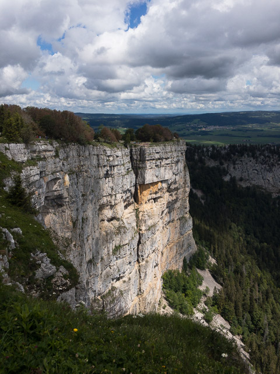
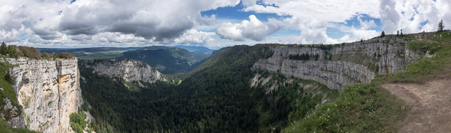

## Yverdon-les-Bains

* **Canton of Vaud**
* The **population** of Yverdon-les-Bains, as of December 2019, was **30,156**
* It is known for its **thermal springs** and is an important regional centre for **commerce** and **tourism**

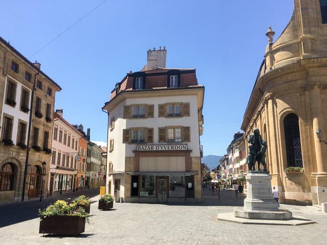

## Aerodrome Yverdon

* Runway 05
* Elevation: 433 m (1,421 ft)
* https://lsgy.ch/

## Gruyères

* The medieval town is an important tourist location in the upper valley of the Saane/Sarine river, and gives its name to **Gruyère cheese**
* The **medieval town** is located at the top of 82 metre-high hill
* The **Castle of Gruyères** is one of the most famous in Switzerland
* In 1998 Swiss surrealist painter, sculptor and set designer **H. R. Giger** acquired the **Saint-Germain Castle**, and it now houses the **H. R. Giger Museum**, a permanent repository of his work
* Hans Ruedi Giger, born **5 February 1940 in Chur**, died **12 May 2014 in Zürich**
* He **moved to Zürich in 1962**, where he studied **architecture and industrial design** at the **School of Applied Arts** until 1970
* He was part of the special effects team that won an **Academy Award for Best Achievement in Visual Effects** for their design work on the film **Alien (1979)**.
* His design for the Alien was **inspired by his painting Necronom IV** and earned him an **Oscar in 1980**
* For most of his career, he worked predominantly in **airbrush**, creating monochromatic canvasses depicting **surreal, nightmarish dreamscapes**

* [Wiki: Gruyères](https://en.wikipedia.org/wiki/Gruy%C3%A8res)
* [Wiki: Gruyères Castle](https://en.wikipedia.org/wiki/Gruy%C3%A8res_Castle)
* [IMDb: Alien](https://www.imdb.com/title/tt0078748/?ref_=fn_al_tt_1)

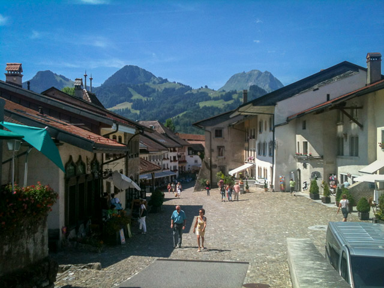
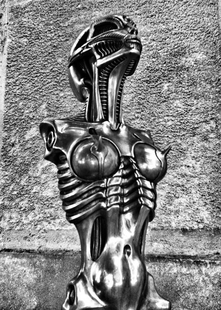

## Saane/Sarine

* The Sarine (in French) or Saane (in German) is a **major river of Switzerland**
* It is **128 km** (80 mi) long
* It is a tributary of the Aare
* [Wiki: Saane/Sarine](https://en.wikipedia.org/wiki/Saane/Sarine)

## Montreux

* Montreux Jazz Festival is the **second largest annual jazz festival** in the world after **Canada's Montreal International Jazz Festival**
* In 1967 the festival was first held at Montreux Casino
* Originally a pure jazz festival, it **opened up in the 1970s** and today presents artists of **nearly every imaginable music style**
* Led Zeppelin, Pink Floyd, Frank Zapp, Deep Purple, ...

### Smoke on the Water

* The **Montreux Casino burned down in December 1971** during Frank Zappa's performance, as referenced in **"Smoke on the Water"** by **Deep Purple**
  - It was first released on their 1972 album Machine Head
  - In **2004**, the song was ranked number **434** on Rolling Stone magazine's list of the **500 greatest songs of all time**
  - ranked number **4** in Total Guitar magazine's **Greatest Guitar Riffs Ever**
  - and in **March 2005**, Q magazine placed **"Smoke on the Water"** at number **12** in its list of the **100 greatest guitar tracks**
* Central theme ("guitar riff") developed by guitarist **Ritchie Blackmore**
* On **4 December 1971**, Deep Purple were in Montreux, Switzerland, **to record an album (Machine Head)**
* On the eve of the recording session, a **Frank Zappa and The Mothers of Invention concert** was held in the casino's theatre
* This was to be the **theatre's final concert before the casino complex closed down for its annual winter renovations**
* which would allow Deep Purple to record there
* At the beginning of **Don Preston's synthesizer solo** on "King Kong", the place suddenly caught fire when **somebody in the audience fired a flare gun toward the rattan covered ceiling**, as mentioned in the "some stupid with a flare gun" line
* Because of the incident and the **exposure** Montreux received when "Smoke on the Water" became an international hit, **Deep Purple formed a lasting bond with the town** 
* The **song is honoured in Montreux by a sculpture** along the lake shore (right next to the **statue of Queen frontman Freddie Mercury**) with the band's name, the song title, and the riff in musical notes 
* The **new casino** in Montreux displays **notes from the riff as decoration on its balustrade** facing the gambling hall

### Queen / Freddie Mercury

* **Mountain Studios** in Montreux, Switzerland, **Queen's recording studio from 1978 to 1995**
* Mercury recorded his **final vocals** here in May 1991
* In **December 2013**, the studio was opened free as the **"Queen Studio Experience"**
* A statue in Montreux, Switzerland, by sculptor Irena Sedlecká, was erected as a tribute to Mercury

* [Wiki: Montreux Jazz Festival](https://en.wikipedia.org/wiki/Montreux_Jazz_Festival)
* [Wiki: Smoke on the Water](https://en.wikipedia.org/wiki/Smoke_on_the_Water)
* [Wiki: Freddie Mercury](https://en.wikipedia.org/wiki/Freddie_Mercury)

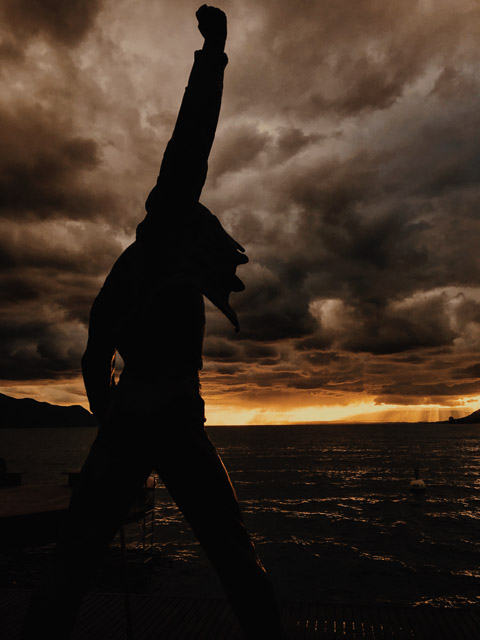
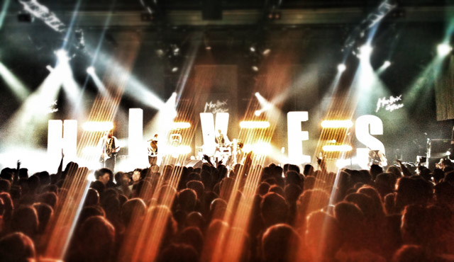

## Lausanne

* The municipality Lausanne has a population of about 140,000, fourth largest city of Switzerland
* Lausanne is a focus of international sport, hosting the **International Olympic Committee** (which has recognized the city as the **"Olympic Capital" since 1994**), the **Court of Arbitration for Sport** and **some 55 international sport associations**
* Lausanne Cathedral: Construction of the Cathedral began as early as **1170** by an original **unknown master mason**. Twenty years later **another master mason restarted construction until 1215**
* The **great pipe organ** of the Cathedral of **Notre Dame of Lausanne** was inaugurated in **December 2003**
* It is a **unique instrument** in the world
* It took **ten years to design** it and it is composed of **7000 pipes**, two consoles, five manuals, and one pedalboard
* It is also the **first organ manufactured by an American company (Fisk)** for a **European Cathedral**
* It cost a total of **6 million Swiss francs**, took **150,000 man-hours** to build and weighs **40 tons**

* [Wiki: Lausanne](https://en.wikipedia.org/wiki/Lausanne)
* [Wiki: Lausanne Cathedral](https://en.wikipedia.org/wiki/Lausanne_Cathedral)

## Vufflens Castle

* **Vufflens Castle** is a **medieval castle** in the Swiss municipality of Vufflens-le-Château in the canton of Vaud
* It is a **Swiss heritage site** of national significance
* The castle was **built in 1425** 
* In **1530**, it was **set on fire by Bernese troops**
* he castle is **privately owned**
* https://en.wikipedia.org/wiki/Vufflens_Castle

## Lake Geneva

* Lake Geneva is a deep lake on the **north side of the Alps**, shared between Switzerland and France
* It is one of the **largest lakes in Western Europe** and the largest on the course of the **Rhône**
* The shore between Nyon and Lausanne is called La Côte because it is flatter
* Between **Lausanne and Vevey** it is called **Lavaux** and is famous for its **hilly vineyards**
* [Wiki: Lake Geneva](https://en.wikipedia.org/wiki/Lake_Geneva)

## Geneva

* Geneva is the **second-most populous city** in Switzerland (after Zürich) and the **most populous city of Romandy**, the French-speaking part of Switzerland
* The municipality has a population (as of December 2019) of **203,951**
* Geneva is a **global city**, a **financial centre**, and a **worldwide centre for diplomacy** due to the presence of numerous **international organizations**, including the **headquarters of many agencies of the United Nations** and the **Red Cross**
* Geneva hosts the **highest number of international organizations** in the world
* It is also where the **Geneva Conventions** were signed, which chiefly concern the **treatment of wartime non-combatants** and **prisoners of war**
* Famous people:
  - **Vladimir Lenin** (1870–1924), **lived in Geneva 1902–1905** as an **exile** from the Russian Empire
  - **Ian Fleming** (1908–1964), author (James Bond), **studied psychology** briefly in Geneva in 1931
  - **Edward Snowden** (born 1983), **lived in Geneva between 2007 and 2009**, while working for the CIA
* [Wiki: Geneva](https://en.wikipedia.org/wiki/Geneva)

## CERN

* The **European Organization for Nuclear Research** (French: **Organisation européenne pour la recherche nucléaire**), known as **CERN**; derived from the name **Conseil européen pour la recherche nucléaire**), is a **European research organization** that operates the **largest particle physics laboratory in the world**
* Established in **1954**, the organization is based in a **northwest suburb of Geneva on the Franco–Swiss border** and has **23 member states**
* **Israel** is the only **non-European country granted full membership**
* The acronym CERN is also used to refer to the **laboratory**, which in *2016* had **2,500 scientific, technical, and administrative staff** members, and hosted about **12,000 users**
* In the same year, CERN **generated 49 petabytes of data** (FS 2020 / Bing world data: 2 petabyte)
* CERN is also the **birthplace** of the **World Wide Web**
* The **World Wide Web** began as a CERN project named **ENQUIRE**, initiated by **Tim Berners-Lee** in **1989** and **Robert Cailliau** in **1990**
* British scientist **Berners-Lee** and **Cailliau** were **jointly honoured by the Association for Computing Machinery in 1995** for their contributions to the **development of the World Wide Web**
* Based on the concept of **hypertext**, the project was intended to **facilitate the sharing of information between researchers**
* [CERN](https://home.cern/)
* [Wiki: CERN](https://en.wikipedia.org/wiki/CERN)

## Airport Geneva (LSGG)

* Elevation: **1,411 ft / 430 m**
* **Runway 22**
