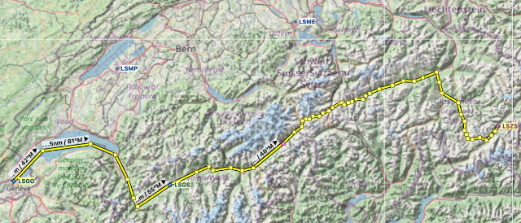
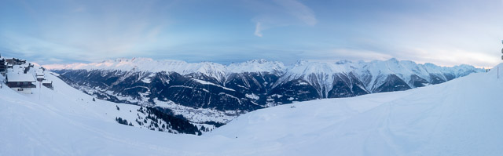
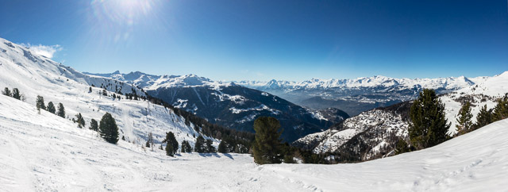
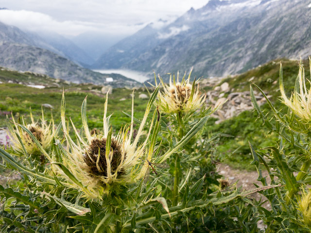
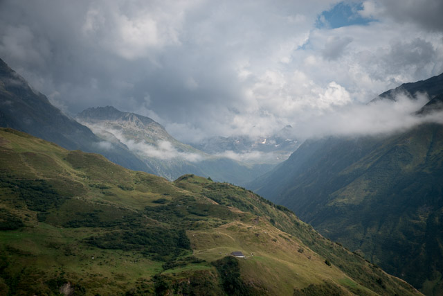
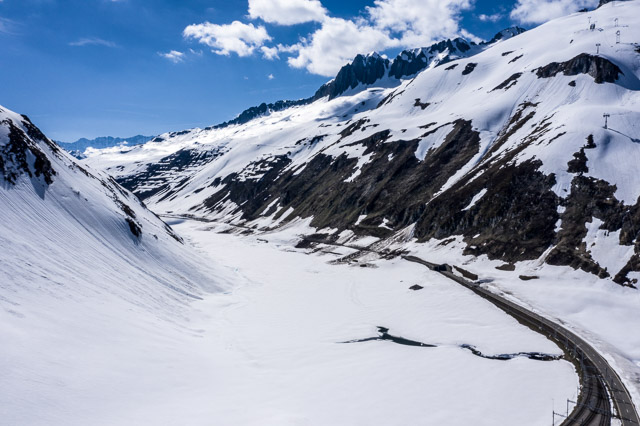
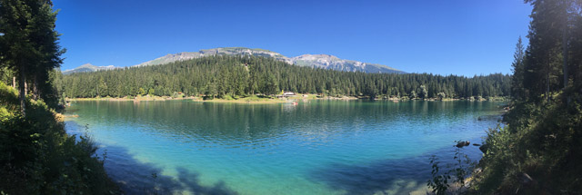
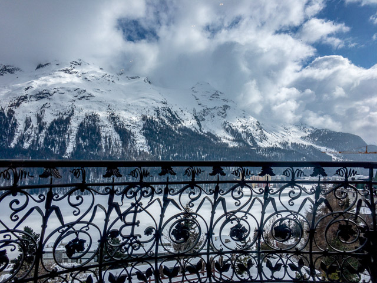
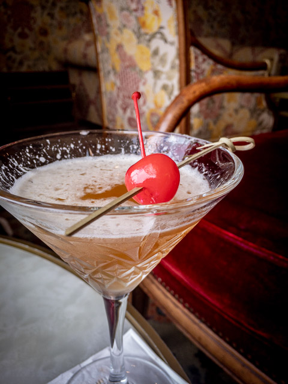

# "Hot Potato" - Leg 4

| What            | Description
| --------------- | ----------------
| Date            | January 15 2021
| Time            | 1930Z
| Server          | North Europe
| Multiplayer     | All
| Voice Chat      | Event channel on the official FS2020 Discord server https://discord.gg/msfs
| Aircraft        | Textron Aviation Cessna Citation CJ4 (cruise speed: 250+ knots)
| Weather         | Live Weather (or Scattered Clouds, Snow Coverage: 20)
| Simulation Time | 1630 local (1530 UTC)
| Flight Plan     | [Tell Tours - Geneva to Samedan.pln](https://github.com/till213/Tell-Tours/blob/main/Europe/Switzerland/Steeler/Leg-4/Tell%20Tours%20-%20Bern%20to%20Geneva.pln)
| Calendar        | [Tell Tours - Geneva to Samedan.ics](https://github.com/till213/Tell-Tours/blob/main/Europe/Switzerland/Steeler/Leg-4/Tell%20Tours%20-%20Geneva%20to%20Samedan.ics)
| FS Forum        | [[Tell Tours] Switzerland - "Hot Potato"](https://forums.flightsimulator.com/t/tell-tours-switzerland-hot-potato-leg-4/345071/)

## Optional Sceneries

| Description                         | Download                                                              | Comment
| ----------------------------------- | --------------------------------------------------------------------- | -------
| Geneva                              | https://flightsim.to/file/2848/geneva-city-switzerland                | Same scenery as for [previous leg 3](../Leg-3/README.md)
| Saint Moritz - Samedan Airport LSZS | https://flightsim.to/file/3361/saint-moritz-samedan-airport-lszs-v1-0 | Requires the SDR Scenery Pack v1-0
| Airport assets                      | https://flightsim.to/file/6072/sdr-scenery-pack-v1-0                  |

# Geneva (LSGG) to Samedan (LSZS)

## Geneva Airport (LSGG)

* A simple airfield was established **in 1919** in Cointrin (near Geneva)
* From **1926 to 1931**, the airfield's wooden sheds were replaced by **three concrete hangars**
* By **1930**, there were **six airlines** that flew to Geneva Airport on **seven different routes**.
* As part of the Federal Government's **post-war planning for the nation's airports**, Cointrin was noted as being well suited for extension ...
* ... and did **not require a triangular runway arrangement** as the **prevailing winds** are very regularly along a single axis
* To provide for jet traffic, **in 1960** the runway was extended to its current length of **3,900 m (12,800 ft)**
* This is **unusually long** for an airport of this size, ...
* ... and could **only be built after some territory was exchanged** between **France** and **Switzerland**
* The runway extension needed to use land that was then French, and an **international agreement was needed** whereby the **necessary land was transferred from France to Switzerland**, and territory of **identical size**, also adjacent to Ferney-Voltaire, **transferred in the opposite direction**
* In this way, Switzerland remained exactly the same size, and **its neutrality remained unsullied**
* Despite there never being a regular **Concorde** service in Switzerland, **the supersonic aircraft twice landed in Geneva**
* On **31 August 1976**, more than **5000 people came to see** the Concorde land
* The current number of **passengers** flying through Cointrin is around **15 million per year**
* For comparison: **Zürich Kloten (LSZH)** has **31 million passengers** per year (2019)
* The airport has a **single concrete runway (04/22)**, which is the **longest in Switzerland with a length of 3,900 m (12,795 ft)** and one of the **longest in Europe**, making it open to use by aircraft of all existing sizes
* The runway had been known as **05/23 until September 13**, **2018**, when it was **changed to 04/22 due to the North Magnetic Pole moving**
* [Wiki: Geneva Airport](https://en.wikipedia.org/wiki/Geneva_Airport)
* [Flughafen Zürich: Zahlen und Fakten](https://www.flughafen-zuerich.ch/unternehmen/flughafen-zuerich-ag/zahlen-und-fakten)

## Airport Sion (LSGS)

* Airport of the city of Sion, Switzerland and is located 2.5 km southwest of Sion city in the **Rhone Valley**
* Because of the **redimension of the Swiss Air** Force it left Sion after **2018** and Sion is **used by civil aviation only**, acting only as alternate airfield for the Air Force
* [Sion Aeroport](https://www.sionaeroport.ch/)
* [Wiki: Sion Airport](https://en.wikipedia.org/wiki/Sion_Airport)
* [Wiki: Helvetic Republic](https://en.wikipedia.org/wiki/Helvetic_Republic)

## Sion

* Sion is one of the **most important pre-historic sites** in Europe
* The site has been settled nearly continuously **since antiquity**
* The oldest trace of human settlement comes from **6200 BC** during the late Mesolithic
* Around **5800 BC** early **Neolithic farmers** from the Mediterranean settled in Sion
* The **settlements** remained **small** until **about 4500 BC**, during the middle Neolithic, when the number of settlements increased sharply
* From the **middle of the 14th century to 1475**, the history of Sion was filled with **wars and destruction**
  - In **1352**, Sion was conquered, pillaged and plundered by an **army from Savoy**
  - Sion was attacked and looted in **1384**, again during the **Raron affair** (a 15th-century rebellion in the Valais against the power of a **local noble family**, the Raron family)
  - in **1418** and finally in *1475* during the **Burgundian Wars**
* The *17th* and *18th* *Centuries* were a **peaceful** time in Sion
* After the **French invasion** of Switzerland on **5 March 1798**, Sion was caught between the **revolutionary spirit**
* Following the creation of the **Helvetic Republic in May 1789** (an early attempt to impose a central authority over Switzerland), a **counter-revolutionary rebellion erupted in the upper Valais**
* This short-lived rebellion was **crushed on 17 May 1789 by French and Vaudois troops** and **Sion was plundered**
* In **May 1799** **counter-revolutionary** forces from **Upper Valais** looted the city again
* After **Napoleon's defeats** during the War of the Sixth Coalition the **Valais was occupied by Austria** at the end of **December 1813**
* Under the **Austrians**, the citizenry received many of their **rights back**
* In **1840**, the **Upper and Lower Valais were reunited**
* But **four years later** (**1844**), Sion was **occupied by Upper Valais** troops during the beginning of the **Sonderbund War**
* **Federal troops** occupied Sion in **November 1847**
* was a civil war in Switzerland
* The **Sonderbund War of November 1847** was a **civil war in Switzerland**, then still a relatively loose confederacy of cantons (states)
* It ensued after **seven Catholic cantons formed the Sonderbund** ("separate alliance") in 1845 to protect their interests against a centralization of power
* The war concluded with the **defeat of the Sonderbund**
* It resulted in the emergence of Switzerland as a federal state in 1848
* The **Sonderbund** consisted of the cantons of **Lucerne, Fribourg, Valais, Uri, Schwyz, Unterwalden and Zug**, all predominantly **Catholic** and governed by **conservative administrations**
* **Public Airshows** have been held at the airfield of Sion
* Aerobatic teams such as the **Frecce Tricolori** from Italy and the **Patrouille de France** have performed there
* [Wiki: Sion](https://en.wikipedia.org/wiki/Sion,_Switzerland)

## Furkapass

* Elevation: **2,429 m (7,969 ft)**
* Border between Valais and Uri
* [Wiki: Furka Pass](https://en.wikipedia.org/wiki/Furka_Pass)

## Tilly

* Location where James Bond (Sean Connery) ditches Tilly Masterson (Tania Mallet) in Goldfinger (1964)
* [ETH Bildarchiv: Tilly](https://www.e-pics.ethz.ch/index/ETHBIB.Bildarchiv/ETHBIB.Bildarchiv_Com_L13-0333-0004-0002_995807.html)
* [ETHZ e-pics Bildarchiv Online](http://ba.e-pics.ethz.ch/) (e.g. search for "james bond")

## Urserental (Uri)

* River Reuss
* In 1946, there were riots over a disputed dam project which intended to flood the entire valley
* It is known as the **Krawall von Andermatt** (riot) on 19 February 1946
* In 1946, **engineer Karl Fetz** was **"chased out of town"** and the architect's office was vandalized
* The project was **abandoned** in the **early 1950s** in favour of the **Göschenen dam (1960)**
* [Wiki: Urseren](https://en.wikipedia.org/wiki/Urseren)

## Oberalp Pass

* Elevation: **2,044 m (6,706 ft)**
* Border between Uri and Graubünden (**canton of Grisons**)
* **The Rhine springs from a source nearby** (Tomasee), which can be accessed by hiking two hours from Oberalp Pass
* [Wiki: Oberalp Pass](https://en.wikipedia.org/wiki/Oberalp_Pass)

## Vorderrhein

* The **Vorderrhein** (English: Anterior Rhine) is one of the **two sources of the Rhine**
* The Vorderrhein is about **76 kilometres** (47 mi) long
* The other initial source is the **Hinterrhein** (English: Posterior Rhine), flowing from the village Hinterrhein near the **San Bernardino Pass** through the **Rheinwald valley** into a gorge called **Roflaschlucht**

* [Wiki: Vorderrhein](https://en.wikipedia.org/wiki/Vorderrhein)
* [Wiki: Hinterrhein](https://en.wikipedia.org/wiki/Hinterrhein_(river))

## St. Moritz

* St. Moritz is a high Alpine resort town in the Engadine in Switzerland, at an elevation of about **1,800 metres** (5,910 ft) above sea level
* It hosted the **Winter Olympics** in **1928** and **1948**
* Pilgrims traveled to Saint Mauritius often to the church of the springs, where they drank from the **blessed, bubbling waters of the Mauritius springs** in the hopes of being healed
* In **1519**, the Medici pope, Leo X, promised **full absolution** to anyone making a pilgrimage to the church of the springs
* **September 1864**, St. Moritz hotel pioneer **Caspar Badrutt** made a wager with **four British summer guests**: they should return in winter and, in the event that the village was not to their liking, he would reimburse their travel costs
* If they were to find St. Moritz attractive in winter, he would invite them **to stay as his guests for as long as they wished**
* This marked not only the **start of winter tourism in St. Moritz** but the start of winter tourism **in the whole of the Alps** 
* The **first electric light in Switzerland** was installed in **1878** at the Kulm Hotel, and ...
* ... the first **curling tournament** on the continent was held in **1880**
* St. Moritz hosted the **1928 Winter Olympics** and again in **1948**
* It has also hosted many other events since, including some unlikely ones **on the frozen lake** in the 1970s and 1980s such as a **golf tournament**, (1979), a **snow polo tournament** (every year in January starting in 1985) and **Cricket on Ice** (1989)
* Every winter it hosts the **"White Turf" horse race** on the **frozen Lake St. Moritz** attended by the international upper class
* Filming locations for James Bond [The Spy Who Loved Me](https://www.imdb.com/title/tt0076752/) and [A View to a Kill](https://www.imdb.com/title/tt0090264/?ref_=fn_al_tt_1) (opening scenes)
* [YouTube: A View To A Kill - Locations](https://www.youtube.com/watch?v=ckwANVxQIc0)

The Spy Who Loved Me - opening ski scene ([YouTube](https://www.youtube.com/watch?v=W5hrltuMPVs)):

 

A View to a Kill - opening ski scene ([YouTube](https://www.youtube.com/watch?v=_44MTHVlAw4)):

 

## Famous People Who Stayed in St. Moritz

* Charlie Chaplin
* Winston Churchill
* Alfred Hitchcock

* [St. Moritz lifestyle](https://www.stmoritz.com/de/lifestyle/)
* [Hitchcock Suite](https://badruttspalace.com/hotel-rooms/hitchcock-suite-winter/)
* [Hitchcock St. Moritz](https://the.hitchcock.zone/wiki/St._Moritz,_Switzerland)
* [Chaplin and Winter Sports](https://www.charliechaplin.com/en/articles/272-Chaplin-and-Winter-Sports?category=biography)
* [Eine Suite für 16'000 Euro](https://www.faz.net/aktuell/stil/palace-hotel-in-sankt-moritz-eine-suite-fuer-16-000-euro-12792278.html)
