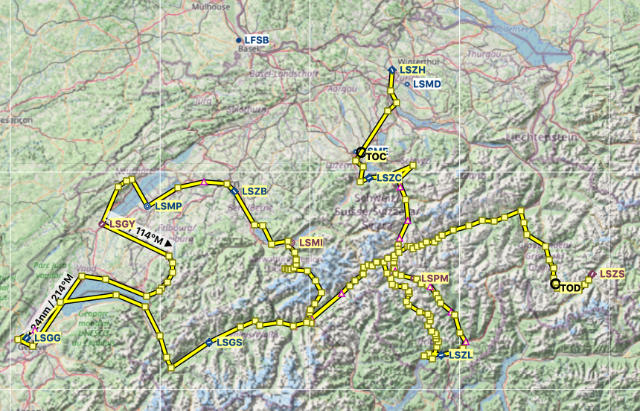

# Tell Tours - Switzerland

A flight of four legs will guide us through Switzerland:

* [Zurich to Locarno - "From North to South"](./Leg-1)
* [Locarno to Bern Belp - "On Her Majesty's Secret Service"](./Leg-2)
* [Bern Belp to Geneva - "Smoke on the Water"](./Leg-3)
* [Geneva to Samedan - "Hot Potato"](./Leg-4)

On the way you will hear fun facts about Switzerland's history (including William Tell, of course), about movie locations and everything else you want to ask during the flights.

 
