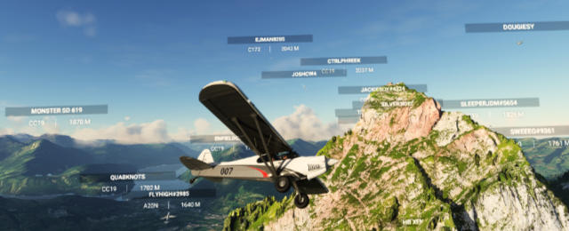

# Tell-Tours

Community flights with the Flight Simulator 2020 (and other flight simulators) where you will learn (fun) facts about the visited locations. 

The first *Tell Tours* flight [Leg 1](https://github.com/till213/Tell-Tours/tree/main/Europe/Switzerland/Steeler/Leg-1) took place in Switzerland on December 16 2020. Home of (legendary figure) William Tell - hence the name *Tell* Tours, but most importantly also referring to *show & tell* (or *fly & tell*).

Who knows... maybe in the future this will be a place for more *Tell Tours* around the world. Pull requests welcome - or ask me to be added as github.com collaborator to this repository, see below.

## Purpose

This repository shall both serve as an archive for flight plans (e.g. &ast;.pln for Flight Simulator 2020) and guide's notes about the visited locations as well as an "online notebook" for upcoming community flights.

The [Template](./Template) may be useful to create new flight descriptions.

## Tours

Guided tours in the following continents exist:

- [Europe](./Europe)

## Create Your Own Tours

### How-To

This repository shall be "flight simulator agnostic", that is you can share your flight plans for various flight simulators such as FS 2020, Prepar3D, X-Plane and others.

The way how to announce and carry out the actual community event probably depends on the actual flight simulator respective its community. So here are some guides which show you how to get started:

- [MS Flight Simulator 2020](./TOURS.FS2020.md)

## Collaboration Wanted

If you are preparing a tour - or have already done so - and want to share your flight plans and tour notes with the posteriority then I am looking forward to add you as *collaborator* to this github repository!

You find my contact details (e-mail) on my [github profile](https://github.com/till213). Or contact me via [Discord](https://discord.com/): my nickname is **Steeler#8662**.

## Resources

* [Little Navmap](https://albar965.github.io/littlenavmap.html)
